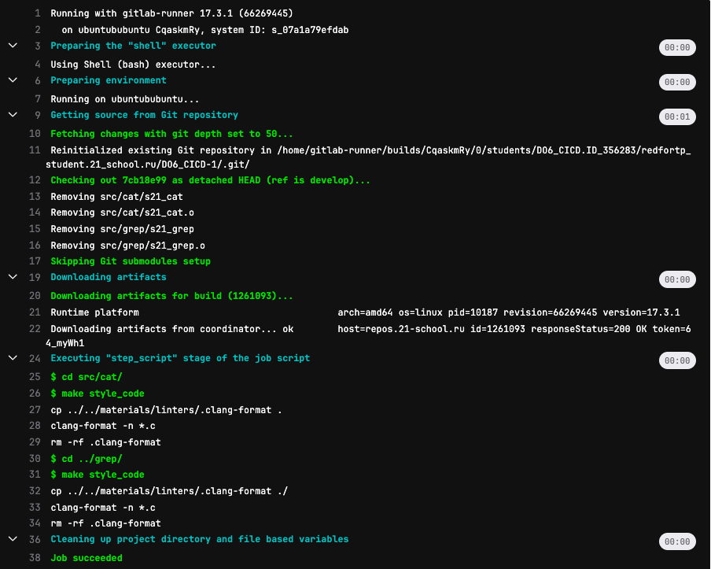
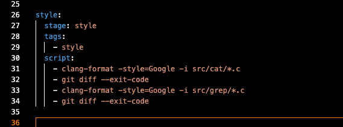

## Part 1. Настройка gitlab-runner

#### Подними виртуальную машину Ubuntu Server 22.04 LTS.

#### Скачай и установи на виртуальную машину gitlab-runner.

Добавила репозиторий gitlab-runner

```
curl -L https://packages.gitlab.com/install/repositories/runner/gitlab-runner/script.deb.sh | sudo bash
```
Установила gitlab- runner 

```
sudo apt install gitlab-runner
```

#### Запусти gitlab-runner и зарегистрируй его для использования в текущем проекте (DO6_CICD)

- sudo gitlab-runner start
- sudo gitlab-runner register


- sudo gitlab-runner verify
- sudo systemctl status gitlab-runner

## Part 2. Сборка
#### Напиши этап для CI по сборке приложений из проекта C2_SimpleBashUtils.

#### В файле gitlab-ci.yml добавь этап запуска сборки через мейк файл из проекта C2.

#### Файлы, полученные после сборки (артефакты), сохрани в произвольную директорию со сроком хранения 30 дней.

- Скопировала папки cat и grep из проекта simpleBashUtils в папку src проекта CICD:

- Создала и описал файл .gitlab-ci.yml : он должен находиться в корневой директории, а не в src
- закомментировала файл .bash_logout

- Файл .gitlab-ci.yml - это файл конфигурации для настройки и определения задач и пайплайнов непрерывной интеграции и непрерывной доставки (CI/CD) в GitLab. В этом файле вы описываете, какие шаги должны выполняться автоматически при каждом пуше кода в ваш репозиторий. После добавления .gitlab-ci.yml файла в ваш репозиторий, GitLab CI/CD будет автоматически создавать пайплайны и выполнять задачи согласно вашим настройкам. Вы сможете видеть результаты выполнения задач в веб-интерфейсе GitLab, а также настраивать уведомления, автоматическое развертывание и другие аспекты CI/CD процесса.


- в гитлабе зараннила пайплайн


## Part 3. Тест кодстайла

#### Напиши этап для CI, который запускает скрипт кодстайла (clang-format).

#### В пайплайне отобрази вывод утилиты clang-format.




#### Если кодстайл не прошел, то «зафейли» пайплайн.



- если использовать clang-format на си, он вернет нулевой выход (без ошибок), и покажет warning, нужно чтобы пейплайн был зафейлен, если появился warning
- Команда git diff --exit-code проверяет, изменился ли файл после применения clang-format.
Если есть изменения (то есть, формат файла был исправлен), команда git diff вернёт ненулевой код выхода, что приведёт к фейлу пайплайна.
- Если файл уже правильно отформатирован, git diff не найдёт изменений и вернёт код выхода 0.


- при неверном кодстайле пейплан зафейлен

## Part 4. Интеграционные тесты

#### Напиши этап для CI, который запускает твои интеграционные тесты из того же проекта.

#### Запусти этот этап автоматически только при условии, если сборка и тест кодстайла прошли успешно.

#### Если тесты не прошли, то «зафейли» пайплайн.

#### В пайплайне отобрази вывод, что интеграционные тесты успешно прошли / провалились.


- меняю ямл файл


- в тесты добавляю вывод error в случае, если тесты не прошли


## Part 5. Этап деплоя
#### Подними вторую виртуальную машину Ubuntu Server 22.04 LTS.

- на обоих машинах настраиваем сеть, чтобы они пинговались друг с другом: /etc/netplan/00-installer-config.yaml


- на первой машинке создаем ssh ключи и копируем их во вторую машинку. Важно создать ssh ключ без пароля

```
ssh-copy-id user@ip
```


#### Напиши этап для CD, который «разворачивает» проект на другой виртуальной машине.


#### Запусти этот этап вручную при условии, что все предыдущие этапы прошли успешно.
```
bash deploy.sh
```


- необходимо дать разрешение (chmod) папке /usr/local/bin
#### Напиши bash-скрипт, который при помощи ssh и scp копирует файлы, полученные после сборки (артефакты), в директорию /usr/local/bin второй виртуальной машины.

 

- В результате вы должны получить готовые к работе приложения из проекта *C2_SimpleBashUtils* (s21_cat и s21_grep) на второй виртуальной машине.


- В файле gitlab-ci.yml добавь этап запуска написанного скрипта.


В случае ошибки «зафейли» пайплайн.


## Part 6. Дополнительно. Уведомления

#### Настрой уведомления об успешном/неуспешном выполнении пайплайна через бота с именем «[твой nickname] DO6 CI/CD» в Telegram.

- узнаем id чата, куда бот должен отправлять сообщение через бота @LeadConverterToolkitBot
- из бота @BotFather получаем токен для нашего бота
- пишем скрипт бота
- добавляем для каждого этапа CI CD запуск скрипта


#### Текст уведомления должен содержать информацию об успешности прохождения как этапа CI, так и этапа CD.
#### В остальном текст уведомления может быть произвольным.

- после каждого пайплайна бот присылает сообщение 

